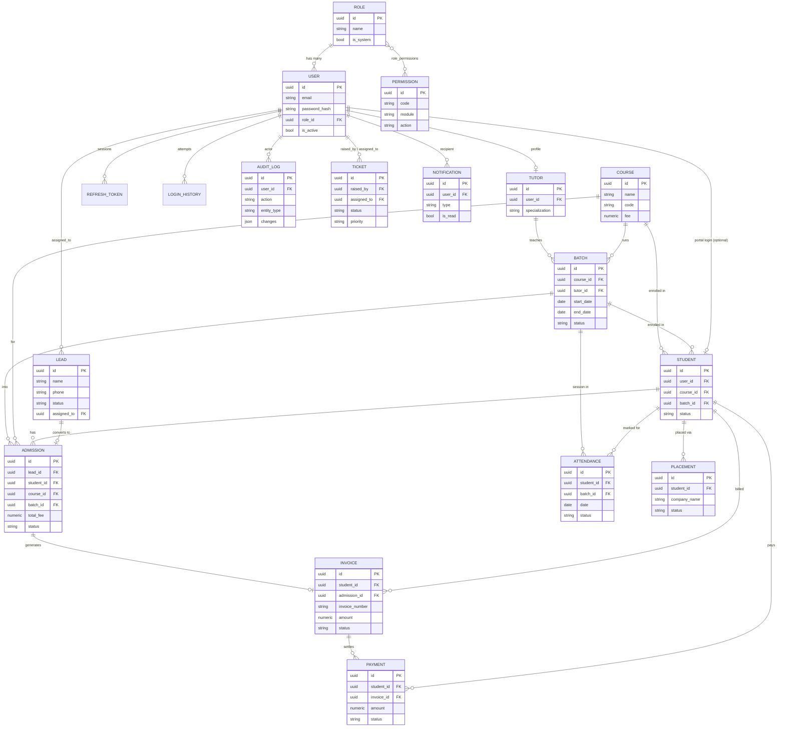

# Database

PostgreSQL, managed via SQLAlchemy 2.0 models and Alembic migrations
(`backend/migrations/`).

## Conventions

Every table (via `BaseModel` in `backend/app/database/base.py`) has:

- `id` — UUID v4 primary key.
- `created_at` / `updated_at` — timestamptz, auto-managed.
- `created_by` / `updated_by` — nullable FK to `users.id` (nullable so
  system/seed-initiated writes don't require a fake user).
- `is_deleted` / `deleted_at` — soft delete. Repositories filter
  `is_deleted = false` by default; nothing is hard-deleted through the API.

Status/type fields (lead status, payment status, batch status, ...) are
stored as `VARCHAR` (`Enum(..., native_enum=False)`), not native Postgres
enum types — adding a new status value later is a data change, not a schema
migration against a Postgres type.

## Entity-Relationship Diagram



## Migrations

```bash
cd backend
alembic revision --autogenerate -m "describe the change"
# review the generated file in migrations/versions/ before applying
alembic upgrade head
```

See [DEVELOPER_GUIDE.md](DEVELOPER_GUIDE.md#alembic-the-rolesusers-circular-fk)
for the one structural gotcha in the initial migration (the roles/users
circular foreign key).

## Seeding

`backend/scripts/seed_db.py` is idempotent — safe to re-run. It populates:

1. Every permission defined in `app/permissions/permission_codes.py`.
2. The default roles and their permission grants
   (`app/permissions/role_definitions.py`).
3. The first Super Admin user, from `FIRST_SUPERUSER_EMAIL`/
   `FIRST_SUPERUSER_PASSWORD` in the environment.
